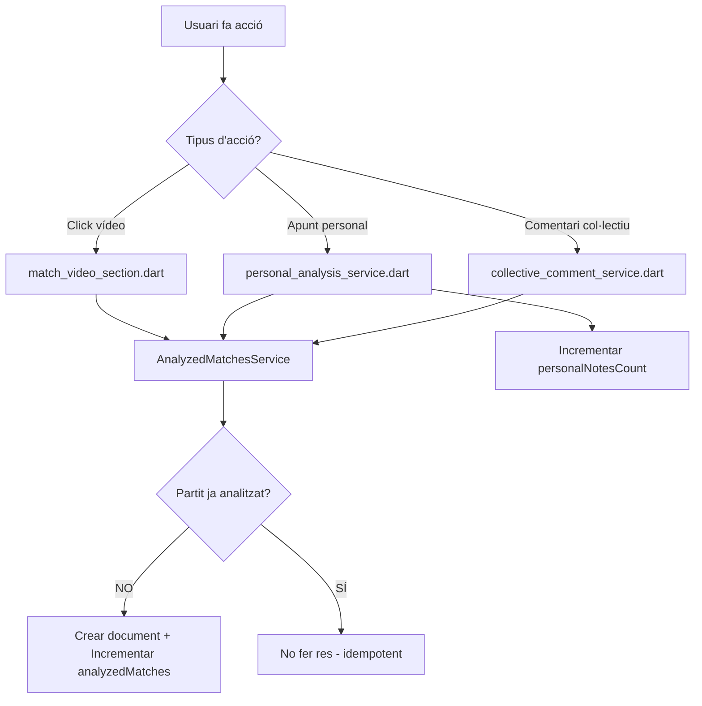

# 📊 Sistema de Tracking de Partits Analitzats

## 🎯 Visió General

Aquest mòdul implementa un **sistema centralitzat de tracking** que actualitza automàticament les estadístiques del perfil de l'usuari a "La teva Empremta".

### Estadístiques gestionades:

| Estadística | Descripció | Actualització |
|-------------|------------|---------------|
| **`analyzedMatches`** | Nombre de partits únics analitzats | Automàtica (només increment) |
| **`personalNotesCount`** | Total d'apunts personals creats | Automàtica (increment/decrement) |
| **`sharedClipsCount`** | Clips públics compartits | Automàtica (només increment) |

---

## 🏗️ Arquitectura del Sistema

### Components principals:

```
lib/features/visionat/services/
├── analyzed_matches_service.dart    ← Servei CENTRALITZAT de tracking
├── personal_analysis_service.dart   ← Integrat amb tracking
├── collective_comment_service.dart  ← Integrat amb tracking
└── README.md                         ← Aquest fitxer
```

### Flux de tracking:



---

## 🔧 Com Funciona

### 1. AnalyzedMatchesService (Servei Centralitzat)

**Ubicació**: `lib/features/visionat/services/analyzed_matches_service.dart`

#### Funció principal: `markMatchAsAnalyzed()`

```dart
await analyzedMatchesService.markMatchAsAnalyzed(
  userId,
  matchId,
  action: 'video_click', // 'personal_note', 'collective_comment'
);
```

**Què fa:**
1. Comprova si `analyzed_matches/{userId}/matches/{matchId}` existeix
2. Si **NO existeix**:
   - Crea el document amb timestamp i acció
   - Incrementa `users/{userId}.analyzedMatches`
3. Si **SÍ existeix**:
   - No fa res (operació idempotent)

**Estructura Firestore:**

```
analyzed_matches/
  {userId}/
    matches/
      {matchId}/
        - matchId: "match_123"
        - analyzedAt: Timestamp
        - firstAction: "video_click"
```

---

### 2. Accions que Marquen un Partit com Analitzat

Un partit es marca com "analitzat" quan l'usuari fa **QUALSEVOL** d'aquestes accions:

#### ✅ Acció 1: Click al vídeo del partit

**On**: `lib/features/visionat/widgets/match_video_section.dart:142-154`

```dart
Future<void> _openRealMatch() async {
  final user = FirebaseAuth.instance.currentUser;
  if (user != null) {
    final analyzedMatchesService = AnalyzedMatchesService();
    await analyzedMatchesService.markMatchAsAnalyzed(
      user.uid,
      widget.matchId,
      action: 'video_click',
    );
  }
  // Obrir enllaç del vídeo...
}
```

#### ✅ Acció 2: Crear apunt personal

**On**: `lib/features/visionat/services/personal_analysis_service.dart:90-96`

```dart
Future<void> addAnalysis(PersonalAnalysis analysis) async {
  // Guardar apunt...

  // Incrementar comptador
  await _firestore.collection('users').doc(analysis.userId).update({
    'personalNotesCount': FieldValue.increment(1),
  });

  // Marcar partit com analitzat
  final analyzedMatchesService = AnalyzedMatchesService();
  await analyzedMatchesService.markMatchAsAnalyzed(
    analysis.userId,
    analysis.matchId,
    action: 'personal_note',
  );
}
```

#### ✅ Acció 3: Crear comentari col·lectiu

**On**: `lib/features/visionat/services/collective_comment_service.dart:68-73`

```dart
Future<void> addComment(CollectiveComment comment) async {
  // Guardar comentari...

  // Marcar partit com analitzat
  final analyzedMatchesService = AnalyzedMatchesService();
  await analyzedMatchesService.markMatchAsAnalyzed(
    comment.createdBy,
    comment.matchId,
    action: 'collective_comment',
  );
}
```

#### ⚠️ Acció 4: Clips compartits - NO implementada

**Per què?** Els clips del perfil (`add_clip_dialog.dart`) no tenen un `matchId` específic vinculat al partit del Visionat. Utilitzen `matchInfo` (text lliure) i poden ser de qualsevol partit, no només el "partit de la setmana".

**Comptador**: Els clips **SÍ** incrementen `sharedClipsCount` però **NO** marquen el partit com analitzat.

---

## 💡 Decisions de Disseny Importants

### ⚠️ DECISIÓ 1: Els partits analitzats NO es desmarquen

**Lògica**: Un cop un usuari analitza un partit (fent qualsevol acció), aquest partit **roman com analitzat PERMANENTMENT**, encara que després elimini tots els seus apunts o comentaris.

**Justificació**:
- L'usuari realment va dedicar temps a aquest partit
- Reflecteix millor l'activitat real de l'usuari
- Evita confusió amb comptadors que pugen i baixen constantment
- Més senzill de gestionar (no cal verificar si queden altres accions)

**Implementació**:
- `deleteAnalysis()` decrementa `personalNotesCount` però **NO** `analyzedMatches`
- `deleteAllForUser()` reseteja `personalNotesCount` però **NO** `analyzedMatches`

### ⚠️ DECISIÓ 2: Sistema idempotent

**Què significa?** Pots cridar `markMatchAsAnalyzed()` múltiples vegades per al mateix partit sense problemes.

**Exemple**:
```dart
// Primera crida: Crea document + incrementa analyzedMatches
await service.markMatchAsAnalyzed('user1', 'match_123', action: 'video_click');

// Segona crida: No fa res (partit ja marcat)
await service.markMatchAsAnalyzed('user1', 'match_123', action: 'personal_note');

// Resultat: analyzedMatches += 1 (només la primera vegada)
```

**Avantatge**: No cal verificar si el partit ja està analitzat abans de cridar la funció.

### ⚠️ DECISIÓ 3: Guardar l'acció que va marcar el partit

Cada document d'`analyzed_matches` guarda quina acció va marcar el partit primer (`firstAction`).

**Utilitat**:
- **Debug**: Saber com l'usuari va interactuar primer amb el partit
- **Analytics**: Estadístiques sobre quines accions són més comunes
- **Future**: Possibilitat de crear reports (ex: "80% dels usuaris fan click al vídeo abans d'escriure apunts")

---

## 🚀 Exemples d'Ús

### Exemple 1: Afegir tracking a una nova acció

Imagina que vols afegir tracking quan l'usuari crea un highlight:

```dart
// A highlight_service.dart
import 'analyzed_matches_service.dart';

Future<void> addHighlight(Highlight highlight) async {
  // 1. Guardar el highlight a Firestore
  await _firestore.collection('highlights').add(highlight.toJson());

  // 2. Marcar partit com analitzat
  final analyzedMatchesService = AnalyzedMatchesService();
  await analyzedMatchesService.markMatchAsAnalyzed(
    highlight.userId,
    highlight.matchId,
    action: 'highlight_created',
  );
}
```

### Exemple 2: Consultar partits analitzats

```dart
final analyzedMatchesService = AnalyzedMatchesService();

// Verificar si un partit està analitzat
bool isAnalyzed = await analyzedMatchesService.isMatchAnalyzed('user1', 'match_123');

// Obtenir tots els partits analitzats
List<String> matches = await analyzedMatchesService.getAnalyzedMatches('user1');
print('L\'usuari ha analitzat ${matches.length} partits');
```

### Exemple 3: Resetear partits analitzats (testing)

```dart
// Útil per testing o si l'usuari vol "començar de nou"
await analyzedMatchesService.resetAllAnalyzedMatches('user1');
// analyzedMatches = 0, tots els documents eliminats
```

---

## 📊 Actualització de Comptadors

### `personalNotesCount`

| Acció | Operació | On |
|-------|----------|-----|
| Crear apunt | `+1` | `personal_analysis_service.dart:86` |
| Eliminar apunt | `-1` | `personal_analysis_service.dart:154` |
| Eliminar tots | `= 0` | `personal_analysis_service.dart:190` |

### `sharedClipsCount`

| Acció | Operació | On |
|-------|----------|-----|
| Compartir clip públic | `+1` | `add_clip_dialog.dart:190` |

### `analyzedMatches`

| Acció | Operació | On |
|-------|----------|-----|
| Primera acció en partit | `+1` | `analyzed_matches_service.dart:60` |
| Eliminar apunts | **Cap** | - |
| Eliminar tots apunts | **Cap** | - |

**⚠️ Important**: `analyzedMatches` **només incrementa**, mai decrementa.

---

## 🐛 Troubleshooting

### Problema: `analyzedMatches` no s'actualitza

**Solucions**:

1. **Verifica que l'usuari està autenticat**:
   ```dart
   final user = FirebaseAuth.instance.currentUser;
   if (user == null) {
     print('❌ Usuari no autenticat!');
   }
   ```

2. **Comprova els logs de debug**:
   ```
   ✅ Partit match_123 marcat com analitzat (video_click)
   ```

3. **Verifica Firestore**: Comprova que existeix:
   - `analyzed_matches/{userId}/matches/{matchId}`
   - `users/{userId}.analyzedMatches > 0`

4. **Regles de seguretat Firestore**: Assegura't que l'usuari té permisos d'escriptura.

### Problema: Els comptadors estan dessincronitzats

**Exemple**: `personalNotesCount = 5` però només hi ha 3 apunts a Firestore.

**Causa**: Possiblement hi va haver errors en eliminacions o el comptador es va actualitzar manualment.

**Solució**: Funció de recalcul (TODO - no implementada):

```dart
Future<void> recalculateCounters(String userId) async {
  // Comptar apunts reals
  final apunts = await personalAnalysisService.getForUser(userId);

  // Comptar partits reals
  final partits = await analyzedMatchesService.getAnalyzedMatches(userId);

  // Actualitzar Firestore
  await FirebaseFirestore.instance.collection('users').doc(userId).update({
    'personalNotesCount': apunts.length,
    'analyzedMatches': partits.length,
  });
}
```

### Problema: Errors de permisos a Firestore

**Error**: `Missing or insufficient permissions`

**Solució**: Afegir regles de seguretat a `firestore.rules`:

```javascript
// Regla per analyzed_matches
match /analyzed_matches/{userId}/matches/{matchId} {
  allow read, write: if request.auth != null && request.auth.uid == userId;
}

// Regla per users (comptadors)
match /users/{userId} {
  allow read: if request.auth != null;
  allow write: if request.auth != null && request.auth.uid == userId;
}
```

---

## 🔮 Futures Millores (TODO)

### 1. Analytics avançat
```dart
// Quines accions són més comunes?
Map<String, int> actionStats = await analyzedMatchesService.getActionStats('user1');
// { 'video_click': 45, 'personal_note': 30, 'collective_comment': 15 }
```

### 2. Timestamps detallats
```dart
// Quan va analitzar cada partit?
List<AnalyzedMatch> matches = await analyzedMatchesService.getAnalyzedMatchesWithTimestamps('user1');
matches.forEach((m) => print('${m.matchId}: ${m.analyzedAt}'));
```

### 3. Funció de recalcul de comptadors
```dart
// Recalcular tots els comptadors des de zero
await recalculateAllCounters('user1');
```

### 4. Desmarcatge intel·ligent (opcional)
```dart
// Si l'usuari elimina TOTES les seves interaccions amb un partit
// (apunts + comentaris + highlights), desmarcar-lo
await intelligentUnmarkMatch('user1', 'match_123');
```

---

## 📚 Referències Ràpides

### Fitxers clau:

| Fitxer | Responsabilitat |
|--------|-----------------|
| `analyzed_matches_service.dart` | Servei centralitzat de tracking |
| `personal_analysis_service.dart` | CRUD apunts + tracking |
| `collective_comment_service.dart` | CRUD comentaris + tracking |
| `match_video_section.dart` | Click vídeo + tracking |
| `profile_model.dart` | Getters comptadors perfil |
| `profile_footprint_widget.dart` | UI "La teva Empremta" |

### Col·leccions Firestore:

| Col·lecció | Estructura |
|------------|------------|
| `users/{userId}` | `analyzedMatches`, `personalNotesCount`, `sharedClipsCount` |
| `analyzed_matches/{userId}/matches/{matchId}` | `matchId`, `analyzedAt`, `firstAction` |
| `personal_analysis/{userId}/entries/{analysisId}` | Apunts personals |
| `collective_comments/{matchId}/entries/{commentId}` | Comentaris col·lectius |

---

## ✅ Checklist de Manteniment

Quan modifiques el sistema de tracking:

- [ ] Actualitzar aquest README si canvia la lògica
- [ ] Afegir tests per a noves accions de tracking
- [ ] Verificar que les regles de Firestore permeten les operacions
- [ ] Comprovar que els comptadors s'actualitzen correctament
- [ ] Actualitzar la UI del perfil si cal
- [ ] Documentar noves decisions de disseny

---

**Darrera actualització**: 24 de desembre de 2025
**Versió**: 1.0
**Autor**: Sistema implementat per Claude Code amb aprovació de l'equip
